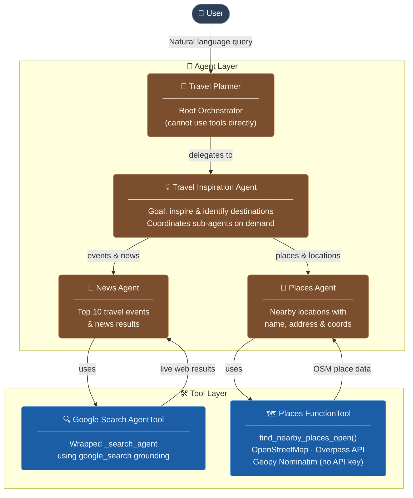

# ✈️ Travel Planner — Multi-Agent AI Application

> **A production-grade multi-agent travel planning system built with [Google Agent Development Kit (ADK)](https://google.github.io/adk-docs/) and Gemini.**  
> Orchestrates specialized AI sub-agents to deliver destination inspiration, real-time news, and nearby place discovery — all in one seamless conversation.

---

## 📐 Architecture



---

## 🗂️ Project Structure

```
Google-ADK-main/
├── main.py                          # Entry point
├── pyproject.toml                   # Project dependencies (uv)
├── .gitignore
└── travel_planner/
    ├── agent.py                     # Root agent — Travel Planner
    ├── supporting_agents.py         # Sub-agents: Inspiration, News, Places
    └── tools.py                     # Tool definitions: Google Search + OSM Places
```

---

## 🤖 Agent Roles

| Agent | Role | Tools Used |
|---|---|---|
| **Travel Planner** | Root orchestrator. Receives user queries and delegates exclusively to sub-agents. Cannot invoke tools directly. | — |
| **Travel Inspiration Agent** | Core reasoning agent. Inspires users with destination ideas, answers knowledge questions, and coordinates News/Places agents. | `AgentTool(news_agent)`, `AgentTool(places_agent)` |
| **News Agent** | Fetches up-to-date travel events and news. Returns up to 10 bullet-pointed results relevant to the user's destination query. | `google_search_grounding` |
| **Places Agent** | Returns real-world place suggestions (hotels, cafés, attractions). Each result includes name, address, and coordinates. | `location_search_tool` |

---

## 🛠️ Tool Definitions

### 🔍 `google_search_grounding` — Google Search AgentTool

An `AgentTool` wrapping an internal `_search_agent` that leverages Google ADK's native `google_search` grounding capability.

- Returns **actionable, tourist-focused bullet points**
- Suited for real-time news, event listings, and travel advisories
- No external API key required beyond standard ADK credentials

### 🗺️ `location_search_tool` — Places FunctionTool

A `FunctionTool` wrapping `find_nearby_places_open()` — a **fully free, zero-API-key** place search:

```
find_nearby_places_open(query, location, radius=3000, limit=5)
```

| Step | Service | Purpose |
|------|---------|---------|
| 1 | **Geopy / Nominatim** | Geocodes the location string → lat/lon |
| 2 | **Overpass API (OSM)** | Queries nodes by name, amenity, or shop tag within radius |
| 3 | Format | Returns name + address for each matched place |

---

## ⚙️ Setup & Installation

### Prerequisites

- Python **≥ 3.12**
- [`uv`](https://github.com/astral-sh/uv) package manager
- Google ADK credentials configured

### Install

```bash
# Clone the repository
git clone https://github.com/your-username/Google-ADK.git
cd Google-ADK-main

# Install dependencies with uv
uv sync
```

### Environment Variables

Create a `.env` file in the project root:

```env
GOOGLE_API_KEY=your_google_api_key_here
# or configure ADK credentials as per Google ADK documentation
```

### Run

```bash
# Run the ADK development UI
uv run adk web

# Or run the CLI entry point
uv run python main.py
```

---

## 📦 Dependencies

| Package | Version | Purpose |
|---------|---------|---------|
| `google-adk` | ≥ 1.33.0 | Multi-agent orchestration framework |
| `geopy` | ≥ 2.4.1 | Geocoding via Nominatim (OpenStreetMap) |
| `python-dotenv` | ≥ 1.2.2 | Environment variable management |

---

## 💬 Example Interactions

```
User: "I want a beach holiday in Saint Martin"
  └─▶ Travel Planner
        └─▶ Travel Inspiration Agent
              ├─▶ News Agent      → "Top 10 travel events & news in Saint Martin"
              └─▶ Places Agent    → "Hotels & resorts near Orient Bay Beach, Saint Martin"
```

```
User: "Find restaurants near Grand Case, Saint Martin"
  └─▶ Travel Planner
        └─▶ Travel Inspiration Agent
              └─▶ Places Agent → OSM query: restaurants within 3km of Grand Case, Saint Martin
```

```
User: "What's happening in Saint Martin this season?"
  └─▶ Travel Planner
        └─▶ Travel Inspiration Agent
              └─▶ News Agent → Google Search: current events, festivals & travel advisories for Saint Martin
```

---

## 🏗️ Built With

| Technology | Role |
|------------|------|
| [Google ADK](https://google.github.io/adk-docs/) | Agent orchestration & tool integration |
| [gemini-3.1-flash-lite](https://deepmind.google/technologies/gemini/) | LLM backbone for all agents |
| [OpenStreetMap / Overpass API](https://overpass-api.de/) | Free geospatial place search |
| [Geopy / Nominatim](https://geopy.readthedocs.io/) | Free geocoding |
| [uv](https://github.com/astral-sh/uv) | Fast Python package management |

---

## 📄 License

This project is open-source. See [LICENSE](./LICENSE) for details.

---

<div align="center">
  <sub>Built with ❤️ using Google Agent Development Kit</sub>
</div>
